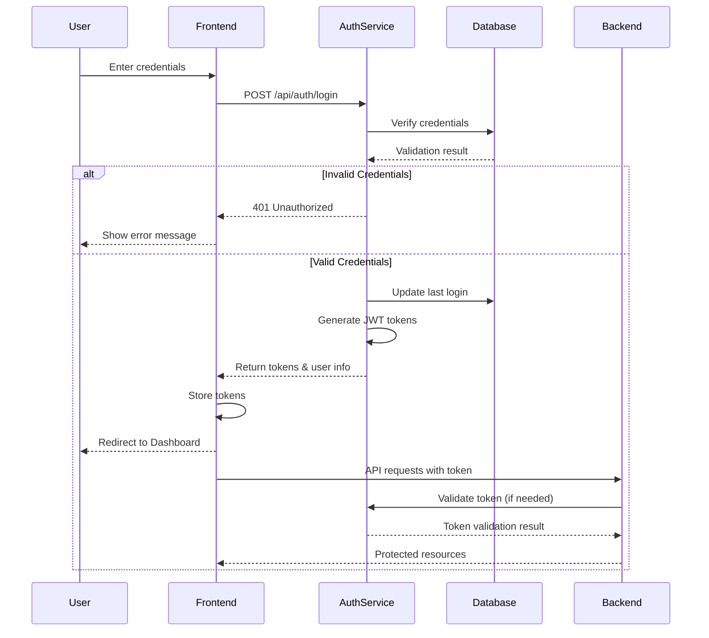
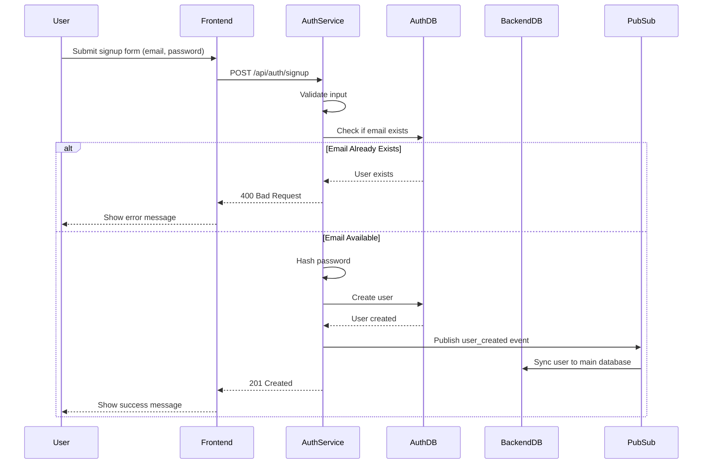
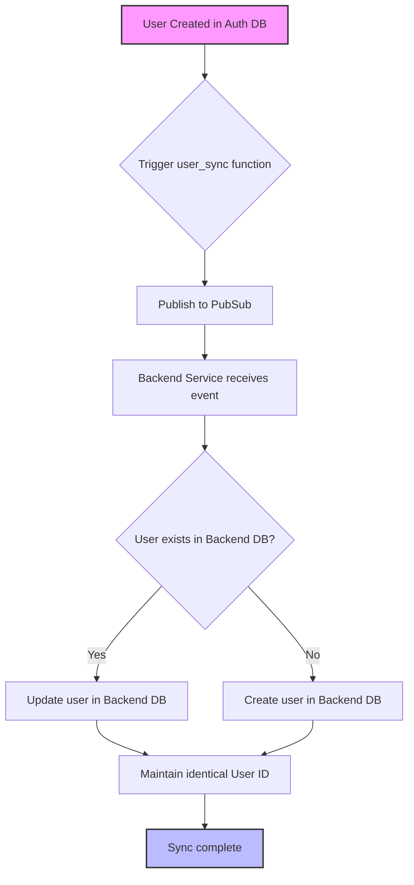

# Authentication Service

This service provides a complete authentication system with various endpoints for user management, authentication, and OAuth integration. The service is built with Express.js, TypeScript, PostgreSQL, and Google Cloud services.

## Recent Updates

The Authentication Service has received significant enhancements for improved reliability, security, and interoperability:

### Simplified User Registration (New)
- **Streamlined Signup Process**: Email and password only required for signup
- **Simplified Password Requirements**: Minimum 6 characters with at least one number
- **Optional Name Field**: Name field is now optional during registration
- **Improved User Experience**: Faster signup process with fewer fields

### Rate Limiting Protection
- **Enhanced Security**: Advanced rate limiting to protect against brute force attacks
- **Tiered Approach**: Stricter limits (10 reqs/15min) on sensitive endpoints like login and signup
- **General Protection**: Standard rate limits (100 reqs/5min) on all API routes
- **Smart Response Handling**: Rate limit responses include helpful retry information

### OAuth2 Improvements
- **Robust Error Handling**: Better error detection and validation for Google OAuth flows
- **Parameter Validation**: Strict validation of all OAuth callback parameters
- **Security Enhancement**: Improved state token validation for CSRF protection
- **Fallback Mechanisms**: Graceful handling of edge cases in OAuth responses

### API Resilience Protocol
- **Standardized Error Handling**: Consistent error responses across all endpoints
- **Self-Documenting API**: Error responses include context about the request and helpful documentation
- **Type-Safety**: Improved TypeScript typing for better development experience
- **Client Experience**: Enhanced error messages make debugging and integration easier

### Session Management Enhancements
- **Improved Logout Flow**: Enhanced token validation during logout
- **Better Token Refresh**: More robust refresh token validation and error handling
- **User-Friendly Responses**: Improved responses with additional useful metadata

These updates make the Authentication Service more robust, secure, and developer-friendly.

## Features

- User authentication with JWT tokens
- Session management with refresh tokens
- Google OAuth integration
- Password management and recovery
- Account security features (lockout, rate limiting)
- Event publishing for user creation
- Database-backed token storage
- Row Level Security (RLS) for data protection
- Self-documenting API with standardized error responses
- User synchronization between authentication and main databases

## Integration with NIFYA Ecosystem

The Authentication Service is a critical component of the NIFYA platform, providing identity management for all microservices:

- **Frontend**: Provides JWT tokens for authenticated sessions and handles user login/registration flows
- **Backend API**: Validates authentication tokens for protected routes
- **Notification Worker**: Uses user identity for sending personalized notifications
- **Subscription Worker**: Associates subscriptions with authenticated users
- **BOE Parser**: User identity is used to filter relevant documents
- **Email Notification Service**: Securely delivers messages to verified users

### Communication Flow

```
┌─────────────┐     Auth      ┌─────────────┐
│   Frontend  │◄────Flow─────►│   Auth      │
└─────────────┘               │   Service   │
       ▲                      └─────────────┘
       │                             ▲
       │                             │
       ▼                             ▼
┌─────────────┐    Validation  ┌─────────────┐
│  Backend    │◄───────────────┤  PubSub     │
│  API        │                │  Events     │
└─────────────┘                └─────────────┘
       ▲                             ▲
       │                             │
       ▼                             │
┌─────────────┐                      │
│ Microservice│                      │
│ Ecosystem   │◄─────────────────────┘
└─────────────┘
```

## System Processes

### User Authentication Process



### User Registration Process



### Database Synchronization Process



## Status Icons
- ✅ Implemented and Working
- ⚠️ Partially Implemented
- ❌ Not Implemented

## Authentication Endpoints

### User Registration and Authentication

#### `POST /api/auth/signup` ✅
- **Purpose**: Register a new user
- **Body**: 
  ```json
  {
    "email": "string",
    "password": "string",
    "name": "string" // Optional
  }
  ```
- **Returns**: User data and authentication tokens
- **Features**:
  - Password validation (min 6 chars, at least one number)
  - Optional name field
  - Email uniqueness check
  - Password hashing with bcrypt
  - Event publishing for user creation
  - Automatic email verification

#### `POST /api/auth/login` ✅
- **Purpose**: Authenticate user and get tokens
- **Body**: 
  ```json
  {
    "email": "string",
    "password": "string"
  }
  ```
- **Returns**: User data, access token, and refresh token
- **Features**:
  - Account lockout after 5 failed attempts
  - Password verification with bcrypt
  - Login attempt tracking
  - Automatic lock release after 15 minutes

#### `POST /api/auth/logout` ✅
- **Purpose**: Invalidate current session
- **Body**: 
  ```json
  {
    "refreshToken": "string"
  }
  ```
- **Returns**: 200 OK with timestamp
  ```json
  {
    "message": "Logged out successfully",
    "timestamp": "2025-03-26T11:59:37.059Z"
  }
  ```
- **Features**:
  - Token validation
  - Specific refresh token revocation
  - Secure session termination
  - Idempotent operation (safe to retry)

### Session Management

#### `POST /api/auth/refresh` ✅
- **Purpose**: Refresh access token
- **Body**: 
  ```json
  {
    "refreshToken": "string"
  }
  ```
- **Returns**: New access and refresh tokens with user data
  ```json
  {
    "accessToken": "string",
    "refreshToken": "string",
    "expiresIn": 900,
    "user": {
      "id": "string",
      "email": "string",
      "name": "string",
      "email_verified": boolean
    }
  }
  ```
- **Features**:
  - Enhanced token validation with format checks
  - Expiration verification
  - Old token revocation
  - Database-backed token storage
  - Includes token expiration information
  - Returns user data for client-side context refresh

#### `POST /api/auth/revoke-all-sessions` ✅
- **Purpose**: Logout from all devices
- **Headers**: `Authorization: Bearer <token>`
- **Returns**: 200 OK with revocation timestamp
- **Features**:
  - Token validation
  - Complete session termination
  - Audit timestamp

#### `GET /api/auth/session` ✅
- **Purpose**: Validate current session and get user data
- **Headers**: `Authorization: Bearer <token>`
- **Returns**: Session status and user data
  ```json
  {
    "authenticated": true,
    "user": {
      "id": "string",
      "email": "string",
      "name": "string",
      "email_verified": boolean
    },
    "session": {
      "issuedAt": "2025-03-26T11:59:37.059Z",
      "expiresAt": "2025-03-26T12:14:37.059Z",
      "remainingTime": 900
    }
  }
  ```
- **Features**:
  - Token validation
  - Session expiration details
  - User data retrieval
  - Authentication status

### User Management

#### `GET /api/auth/me` ✅
- **Purpose**: Get current user profile
- **Headers**: `Authorization: Bearer <token>`
- **Returns**: User profile data
  ```json
  {
    "id": "string",
    "email": "string",
    "name": "string",
    "createdAt": "2025-03-26T11:59:37.059Z",
    "emailVerified": boolean,
    "preferences": {
      "theme": "light",
      "language": "en",
      "notifications": true
    }
  }
  ```
- **Features**:
  - Token validation
  - User profile retrieval
  - User preferences

#### `POST /api/auth/verify-email` ✅
- **Purpose**: Verify user email address
- **Body**: 
  ```json
  {
    "token": "string"
  }
  ```
- **Returns**: Verification status
  ```json
  {
    "message": "Email verified successfully",
    "email": "string"
  }
  ```
- **Features**:
  - Token validation
  - Email verification
  - User status update

### Password Management

#### `POST /api/auth/forgot-password` ✅
- **Purpose**: Request password reset
- **Body**: 
  ```json
  {
    "email": "string"
  }
  ```
- **Returns**: 200 OK with message
  ```json
  {
    "message": "Password reset instructions sent to email if it exists"
  }
  ```
- **Features**:
  - Email verification
  - Reset token generation
  - Email notification

#### `POST /api/auth/reset-password` ✅
- **Purpose**: Reset password with token
- **Body**: 
  ```json
  {
    "token": "string",
    "password": "string"
  }
  ```
- **Returns**: 200 OK with message
  ```json
  {
    "message": "Password reset successfully"
  }
  ```
- **Features**:
  - Token validation
  - Password validation
  - Password update
  - Session invalidation

#### `POST /api/auth/change-password` ✅
- **Purpose**: Change password when logged in
- **Headers**: `Authorization: Bearer <token>`
- **Body**: 
  ```json
  {
    "currentPassword": "string",
    "newPassword": "string"
  }
  ```
- **Returns**: 200 OK with message
  ```json
  {
    "message": "Password changed successfully"
  }
  ```
- **Features**:
  - Current password verification
  - New password validation
  - Password update
  - Session maintenance

### OAuth Integration

#### `POST /api/auth/google/login` ✅
- **Purpose**: Initiate Google OAuth login
- **Returns**: Google authorization URL
- **Security**: 
  - CSRF protection with state tokens
  - Configurable scopes
  - Secure state management

#### `GET /api/auth/google/callback` ✅
- **Purpose**: Handle Google OAuth callback
- **Query Parameters**:
  ```typescript
  {
    code: string;    // Authorization code
    state: string;   // CSRF token
    nonce?: string;  // Optional nonce for additional security
  }
  ```
- **Returns**: Access token, refresh token, and user data
  ```json
  {
    "user": {
      "id": "string",
      "email": "string",
      "name": "string",
      "picture": "string",
      "firstLogin": boolean
    },
    "accessToken": "string",
    "refreshToken": "string"
  }
  ```
- **Features**:
  - Enhanced parameter validation
  - Comprehensive error messages
  - CSRF protection with state token validation
  - Support for nonce verification
  - Automatic user creation or profile update
  - Profile data synchronization with Google account
  - Error handling for OAuth flow failures
  - Type validation for all parameters

### Debug and Testing Endpoints

#### `GET /health` ✅
- **Purpose**: Check API and database health
- **Returns**: Status OK with detailed service health:
  ```json
  {
    "status": "healthy",
    "version": "1.0.0",
    "uptime": "10d 2h 30m",
    "databaseConnection": "connected",
    "pubsubConnection": "connected",
    "memoryUsage": {
      "rss": "120MB",
      "heapTotal": "80MB",
      "heapUsed": "65MB"
    }
  }
  ```
- **Features**:
  - Database connectivity check
  - Service uptime monitoring
  - Version information
  - Resource usage statistics

#### `POST /api/auth/google/mock` ✅ (Development Only)
- **Purpose**: Mock Google OAuth for testing
- **Body**: 
  ```json
  {
    "email": "string",
    "name": "string"
  }
  ```
- **Returns**: Access token, refresh token, and user data
- **Features**:
  - Test OAuth flow without Google integration
  - Development convenience
  - Disabled in production

#### `GET /api/auth/debug/tokens` ✅ (Development Only)
- **Purpose**: Generate and inspect tokens for testing
- **Query Parameters**:
  ```typescript
  {
    userId?: string;    // Optional user ID
    email?: string;     // Optional email
    name?: string;      // Optional name
    emailVerified?: boolean; // Optional email verification status
  }
  ```
- **Returns**: Generated tokens with decoded content
- **Features**:
  - Test token generation
  - Token inspection
  - Development convenience
  - Disabled in production

#### `POST /api/auth/debug/validate-token` ✅ (Development Only)
- **Purpose**: Validate and inspect JWT token
- **Body**: 
  ```json
  {
    "token": "string"
  }
  ```
- **Returns**: Token validation status and decoded content
- **Features**:
  - Token inspection
  - Validation details
  - Header recommendations
  - Development convenience
  - Disabled in production

## Database Schema

The service uses the database schema defined in [auth-db.sql](./supabase/auth-db.sql). Key tables include:

- `users`: User accounts and profiles
  - Contains user email, password hash, name, and account status
  - Tracks account verification and active status
  - Records registration and last login timestamps

- `tokens`: JWT refresh token management
  - Links refresh tokens to specific users
  - Tracks token expiration and revocation status
  - Enables secure token rotation and revocation

The schema includes triggers for user synchronization between the authentication database and the main application database, ensuring that user identities are consistent across the NIFYA platform.

### Database Synchronization

The user synchronization process ensures that:
1. Users created in the authentication database are automatically synced to the main database
2. The same user ID is maintained across both databases for the same email
3. User profile updates are propagated appropriately
4. Each user has a consistent identity across all NIFYA services

This is implemented via database triggers as defined in the auth-db.sql file. When a user is created or updated in the authentication database, the `trigger_user_sync` function is called, which publishes a message to synchronize the user with the main database.

## Environment Variables

```bash
PORT=3000                    # Server port
JWT_SECRET=your-secret-key   # JWT signing key
JWT_EXPIRES_IN=15m           # JWT token expiration time (15 minutes)
REFRESH_TOKEN_EXPIRES_IN=7d  # Refresh token expiration

# Rate Limiting Configuration
RATE_LIMIT_GENERAL_MAX=100   # Maximum requests for general endpoints
RATE_LIMIT_GENERAL_WINDOW=5  # Window in minutes for general endpoints
RATE_LIMIT_AUTH_MAX=10       # Maximum requests for auth endpoints
RATE_LIMIT_AUTH_WINDOW=15    # Window in minutes for auth endpoints

# Database Configuration
DB_HOST=your-db-host
DB_USER=your-db-user
DB_NAME=your-db-name
DB_PORT=5432
DB_PASSWORD=your-db-password

# Google OAuth
GOOGLE_CLIENT_ID=your-client-id
GOOGLE_CLIENT_SECRET=your-client-secret
GOOGLE_REDIRECT_URI=your-redirect-uri
GOOGLE_OAUTH_STATE_TTL=600   # State token time-to-live in seconds

# PubSub Configuration
PUBSUB_TOPIC_USER_EVENTS=user-events
GOOGLE_CLOUD_PROJECT=your-project-id

# Email Notifications
ENABLE_EMAIL_NOTIFICATIONS=true
EMAIL_SERVICE_URL=http://email-notification:8080

# Security Configuration
CORS_ALLOWED_ORIGINS=netlify.app,localhost  # Comma-separated allowed origins
ACCOUNT_LOCKOUT_ATTEMPTS=5                  # Failed attempts before lockout
ACCOUNT_LOCKOUT_DURATION=15                 # Lockout duration in minutes
```

## Security Features

- **CORS Protection**: Configured headers to prevent cross-origin attacks
- **Advanced Rate Limiting**: 
  - Tiered protection against brute force and DDoS attacks
  - Strict limits on sensitive endpoints (10 reqs/15min for login/signup)
  - General API protection (100 reqs/5min) for all routes
  - Informative responses with retry-after headers
  - IP-based tracking with secure expiration
- **Account Lockout**: Temporary account freeze after multiple failed attempts
- **CSRF Protection**: Token-based protection for state-changing operations
- **Secure Session Management**: 
  - JWT with short expiration and refresh token rotation
  - Enhanced logout flow with token validation
  - Improved refresh token validation
- **Row Level Security (RLS)**: Database-level access controls
- **Event-driven Architecture**: Decoupled processing for security events
- **Password Security**:
  - Bcrypt hashing with appropriate work factor
  - Complexity requirements (min 6 chars with at least one number)
  - No password storage in plain text
  - Secure password reset mechanism
- **Token Management**:
  - Short-lived access tokens
  - Rotation on suspicious activity
  - Database backed for revocation
  - Secure storage recommendations for clients
- **API Resilience**:
  - Standardized error handling across all endpoints
  - Self-documenting error responses with helpful context
  - Consistent error format for better client integration
  - Error classification by type for intelligent handling
- **OAuth2 Security**:
  - Strict parameter validation
  - Enhanced state token protection
  - Detailed error handling
  - Secure token exchange

## API Resilience Components

The Authentication Service implements a comprehensive API resilience protocol to enhance error handling and improve the developer experience. This includes:

### Error Response Builder

Located at `src/shared/errors/ErrorResponseBuilder.ts`, this component:
- Creates standardized error responses across all endpoints
- Includes contextual information about the request
- Provides self-documenting error messages
- Enhances debugging with detailed error context

### API Metadata Repository

Located at `src/shared/utils/apiMetadata.ts`, this serves as:
- A central source of truth for API documentation
- A reference for endpoint validation
- A provider of helpful context in error messages
- A foundation for API discovery and documentation

### Error Handlers

Controllers have been updated to use standard error builders:
- Consistent error handling patterns across endpoints
- Type-safe error construction
- Helpful context in error responses
- Improved client experience with predictable error formats

Example error response:
```json
{
  "error": {
    "code": "UNAUTHORIZED",
    "message": "Authentication required to access this resource.",
    "request_id": "12345-abcde",
    "timestamp": "2023-08-15T12:34:56Z",
    "help": {
      "endpoint_info": {
        "description": "Authenticate and get JWT tokens",
        "auth_required": false,
        "method": "POST"
      },
      "related_endpoints": [
        {
          "path": "/api/auth/signup",
          "methods": ["POST"],
          "description": "Register a new user account"
        }
      ],
      "documentation_url": "https://docs.nifya.app/api/auth/login",
      "required_parameters": [
        {
          "name": "email",
          "type": "string",
          "description": "User email address"
        },
        {
          "name": "password",
          "type": "string",
          "description": "User password"
        }
      ]
    }
  }
}
```

### Common Error Types

The service includes builders for common error types:
- `badRequest` - 400 status code for invalid inputs
- `unauthorized` - 401 status code for authentication failures
- `forbidden` - 403 status code for permission issues
- `notFound` - 404 status code for missing resources
- `tooManyRequests` - 429 status code for rate limiting
- `serverError` - 500 status code for internal errors
- `validationError` - 400 status code for input validation failures
- `accountLocked` - 401 status code with lock expiry details
- `invalidToken` - 400 status code for token issues
- `invalidLoginMethod` - 401 status code for method mismatches

## Monitoring and Metrics

The service exports the following metrics for monitoring:

- **Authentication Metrics**:
  - Login success/failure rates
  - Token refresh rates
  - Token revocation events
  - User registration rate
  
- **Security Metrics**:
  - Failed login attempts
  - Account lockouts
  - Suspicious activity detection
  - Rate limit triggers

- **Performance Metrics**:
  - Response times for critical endpoints
  - Database query performance
  - Token validation speed
  - Error rates

## Event Publishing

The service publishes events to Google Cloud Pub/Sub for:
- User creation
- Profile updates
- Security events

Event format example:
```json
{
  "id": "user-id",
  "email": "user@example.com",
  "name": "User Name",
  "createdAt": "2025-01-23T23:32:28.266Z",
  "emailVerified": true
}
```

## Development

### Prerequisites
- Node.js 18 or higher
- PostgreSQL database
- Google Cloud project with:
  - Secret Manager
  - Pub/Sub
  - Cloud SQL

### Setup
1. Clone the repository
2. Install dependencies:
   ```bash
   npm install
   ```
3. Set up environment variables (copy `.env.example` to `.env`)
4. Start development server:
   ```bash
   npm run dev
   ```

### Build
```bash
npm run build
```

### Production
```bash
npm start
```

## Deployment

### Docker Deployment
The service includes a Dockerfile for containerized deployment:

```bash
# Build the Docker image
docker build -t nifya-auth-service .

# Run container with environment variables
docker run -p 3000:3000 --env-file .env nifya-auth-service
```

### Google Cloud Run Deployment
For serverless deployment on Google Cloud:

```bash
# Build the container
gcloud builds submit --tag gcr.io/PROJECT_ID/nifya-auth-service

# Deploy to Cloud Run
gcloud run deploy nifya-auth-service \
  --image gcr.io/PROJECT_ID/nifya-auth-service \
  --platform managed \
  --region us-central1 \
  --allow-unauthenticated \
  --set-env-vars="JWT_SECRET=SECRET_FROM_SECRET_MANAGER,..."
```

## Troubleshooting

### Common Issues

1. **Token Validation Failures**
   - Check clock synchronization between services
   - Verify JWT_SECRET is consistent across environments
   - Ensure token hasn't been revoked

2. **Database Connection Issues**
   - Check connection string and credentials
   - Verify network connectivity
   - Check PostgreSQL server is running
   - Verify connection pool settings

3. **OAuth Integration Problems**
   - Validate redirect URI configuration
   - Check Google API credentials
   - Verify scopes are properly configured
   - Check CORS settings if using browser redirects

4. **User Synchronization Problems**
   - Verify PubSub topic and subscription are correctly configured
   - Check database triggers are installed and active
   - Verify permissions for database synchronization
   - Check logs for synchronization errors
   - Verify both databases are accessible

## License

This project is proprietary software owned by NIFYA.

## Refactored Architecture (2025 Update)

The Authentication Service has been completely refactored to improve maintainability, error handling, and separation of concerns. This document describes the new architecture and organization of the codebase.

### Directory Structure

The Authentication Service now follows a clean domain-driven design approach with a clear separation of concerns:

```
Authentication-Service/
├── src/
│   ├── auth/                    # Core authentication domain
│   │   ├── controllers/         # HTTP request handlers
│   │   ├── services/            # Business logic 
│   │   ├── validation/          # Input validation
│   │   ├── models/              # Data models and repositories
│   │   └── errors/              # Error definitions and handling
│   ├── database/                # Database connection and queries
│   ├── middleware/              # Express middleware
│   ├── utils/                   # Utility functions
│   ├── api/                     # API routes definition
│   └── index.ts                 # Application entry point
└── supabase/                    # Database schema
```

### Key Architectural Features

#### 1. Error Handling

The service implements a standardized error handling approach:

- **Centralized Error Factory**: All errors are created through a single factory function that ensures consistent format.
- **Machine-Readable Error Codes**: Each error has a unique code for clients to reliably identify error types.
- **Helpful Error Messages**: User-friendly messages with contextual help information.
- **Self-Documenting Errors**: Error responses include additional context about related endpoints and documentation.

Example error response:

```json
{
  "error": {
    "code": "EMAIL_EXISTS",
    "message": "This email is already registered",
    "status": 400,
    "request_id": "12345-abcde",
    "timestamp": "2025-04-10T14:22:15Z",
    "help": {
      "endpoint_info": {
        "description": "Register a new user account",
        "auth_required": false,
        "method": "POST"
      },
      "related_endpoints": [
        {
          "path": "/api/auth/login",
          "methods": ["POST"],
          "description": "Login with existing account"
        }
      ],
      "documentation_url": "https://docs.nifya.app/api/auth/signup"
    }
  }
}
```

#### 2. Validation Layer

Input validation is now handled by a dedicated middleware layer:

- Uses Zod schemas for strong type checking and validation
- Consistent error messages for validation failures
- Centralized validation logic for all endpoints
- Clear separation from business logic

#### 3. Repository Pattern

Database operations are encapsulated in repositories:

- Abstraction layer between services and the database
- Centralized query execution with error handling
- Type-safe return values with defined interfaces
- Simplified testing through mocking

#### 4. Service Layer

Business logic is isolated in service modules:

- Pure business logic separated from HTTP concerns
- Focused on domain operations rather than request/response handling
- Easier to test and maintain
- Centralized error handling

#### 5. Controller Layer

Controllers are now focused only on HTTP concerns:

- Handling HTTP requests and responses
- Translating between HTTP and domain models
- Delegating business logic to services
- No direct database access

#### 6. Middleware-Based Security

Security is implemented through middleware:

- Authentication middleware for protected routes
- Rate limiting to prevent abuse
- CORS protection
- Strong typing for authenticated requests

### Installation and Setup

The installation and setup process remains the same as before. The service requires:

- Node.js 18.x or higher
- PostgreSQL database
- Environment variables for configuration

### Benefits of the New Architecture

1. **Improved Maintainability**: Clear separation of concerns makes it easier to understand and modify code
2. **Enhanced Error Handling**: Standardized error responses improve developer experience
3. **Better Type Safety**: Comprehensive TypeScript typing throughout the codebase
4. **Simplified Testing**: Isolated components can be tested independently
5. **Cleaner API Design**: Consistent API design with well-defined interfaces
6. **Smaller Surface Area**: Each component has a single responsibility

### Migrating from the Old Architecture

The refactoring maintains backward compatibility with the existing API endpoints. Clients using the Authentication Service should continue to work without modifications. The internal implementation has been completely rewritten for better maintainability and scalability.

### Frontend Error Handling

Frontend applications should be updated to handle the new error response format. In particular:

1. Extract the error message from `response.error.message` instead of directly using the response object
2. Use the error code in `response.error.code` for programmatic handling of specific error conditions
3. Display helpful information from `response.error.help` when available

Example frontend error handling:

```typescript
try {
  const result = await api.post('/api/auth/signup', userData);
  // Handle success
} catch (error) {
  if (error.response?.data?.error) {
    // Extract standardized error information
    const { code, message } = error.response.data.error;
    
    // Display user-friendly message
    displayError(message);
    
    // Handle specific error cases
    if (code === 'EMAIL_EXISTS') {
      // Show login link or password recovery options
    }
  } else {
    // Handle unexpected errors
    displayError('An unexpected error occurred');
  }
}
```

This approach prevents the React Error #31 that occurs when trying to directly render error objects in the UI.